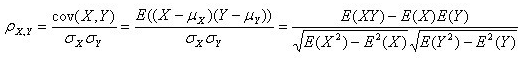

# 回归模型中特征选择方法

<!--more-->


## 协方差对于单变量选择

```
# 计算变量的方差
# 如果方差接近于0，也就是该特征的特征值之间基本上没有差异，这个特征对于样本的区分并没有什么用，剔除
from sklearn.feature_selection import VarianceThreshold
selector = VarianceThreshold(threshold=0.1) #默认threshold=0.0
selector.fit_transform(df[numerical_features])

# 查看各个特征的方差,
selector.variances_ ,len(selector.variances_)

# 特征对应方差
all_used_features_dict = dict(zip(numerical_features,selector.variances_ ))
all_used_features_dict
```

## 数值特征和目标值之间相关性

### 1. 协方差


&emsp;如果协方差为正，说明X,Y同向变化，协方差越大说明同向程度越高；


&emsp;如果协方差维负，说明X，Y反向运动，协方差越小说明反向程度越高；


&emsp;如果两个变量相互独立，那么协方差就是0，说明两个变量不相关。

### 2. pearson系数
#### 
&emsp;2.1 相关概念和值大小含义

相关系数也可以看成协方差：一种剔除了两个变量量纲影响、标准化后的特殊协方差。


可以反映两个变量变化时是同向还是反向，如果同向变化就为正，反向变化就为负。由于它是标准化后的协方差，因此更重要的特性来了，它消除了两个变量变化幅度的影响，而只是单纯反应两个变量每单位变化时的相似程度。

**假设对于Pearson r相关性，两个变量都应该是正态分布的** 

**pearson数值大小衡量相关性：**

0.8-1.0 极强相关 | 0.6-0.8 强相关 | 0.4-0.6 中等程度相关 |
0.2-0.4 弱相关 | 0.0-0.2 极弱相关或无相关

#### 2.2 pearson 系数的优缺点：
&emsp;优点： 可以通过数值对变量之间相关性衡量，正值代表正相关、负值代表负相关、0代表不相关

&emsp;缺点： 没有对变量之间的关系进行提炼和学习，预测其实是学习不同特征之间的组合既关系。只能判别特征之间的线性相关性，如果是非线性相关就不可取。


#### 2.3 适用场景
1. 两个变量之间是线性关系，都是连续数据。
2. 两个变量的总体是正态分布，或接近正态的单峰分布。
3. 两个变量的观测值是成对的，每对观测值之间相互独立。
#### 2.4 相关代码
1. 通过numpy
```
import numpy as np
np.corrcoef([a,b,c,d])
```
2. pandas中corr()函数
```
import matplotlib.pyplot as plt
plt.figure(figsize = (25,25))
#### 传入相关特征即可，输出为所有特征之间相关性
corr_values1 = data[features].corr()
sns.heatmap(corr_values1, annot=True,vmax=1, square=True, cmap="Blues",fmt='.2f')
plt.tight_layout()
plt.savefig('**.png',dpi=600)
plt.show()
```
3. 利用scipy，输出两个值，第一个值为相关系数，第二个值越小代表两个之间相关性越高
```
import numpy as np
from scipy.stats import pearsonr
### 计算两个特征之间相关性，同时也可以计算特征和标签之间相关性
print("Lower noise", df(x, x1))
```
4. 计算每个特征和label之间相关性
```
# drop_list 为不需要计算的特征或者可以是类别变量特征
feature_list = [col for col in df.columns if col not in drop_list]
feature_import_df = pd.DataFrame()
for i,f in enumerate(feature_list):
    feature_import_df.loc[i,'feature_name'] = f
    feature_import_df.loc[i,'pearson'] = np.corroef(df[label],df[f])
### 排序看特征和label之间相关性
feature_import_df.sort_values(by=['pearson'],inplace = True)
```
#### 2.5 通过pearson系数删选特征
&emsp;(1) 通过和label之间的相关性之间，通过设置阈值删选
```
def del_corr_fea(df,cor_df):
    """
    df是原始数据，cor_df为通过pd.corr()获得特征间相关性矩阵，
    """
    cor_df = cor_df.reset_index()
    feature_col = [col for col in df.columns if col not in drop_fea_list]
    drop_fea = []
    for i,f in enumerate(feature_col):
        if f not in drop_fea:
            cor_df1 = cor_df[i+1:][[f,'index']]
            cor_df_sel = cor_df1[cor_df1[f]>=0.8]
            cor_df_sel.sort_values(by=[f],ascending = False,inplace = True)
            del_name = cor_df_sel['index'].values.tolist()[1:]
            drop_fea = del_name + drop_fea
    return drop_fea
drop_list_no_p = del_corr_fea(data_end,corr_values_fea_fea)
```
&emsp;(2) 首先计算不同特征之间相关性，然后通过相关性取出相似性最高的几个特征，并保留和label间系数最高的特征
```
def del_corr_fea(df,cor_df,cor_df_with_label):
    """
    df是原始数据，cor_df为通过pd.corr()获得特征间相关性矩阵，cor_df_with_label和标签之间相关性
    """
    cor_df = cor_df.reset_index()
    cor_df = cor_df.rename(columns = {'index':'feature'})
    feature_col = [col for col in df.columns if col not in drop_fea_list]
    drop_fea = []
    for i,f in enumerate(feature_col):
        if f not in drop_fea:
            print(len(drop_fea))
            cor_df1 = cor_df[i:][[f,'feature']]
            cor_df_sel = cor_df1[cor_df1[f]>=0.8]
            sort_corr_df = cor_df_sel.merge(cor_df_with_label,on = 'feature',how = 'left')
            ## p 更改为相关性矩阵的列名
            sort_corr_df.sort_values(by=['p'],ascending = False,inplace = True)
            del_name = sort_corr_df['feature'].values.tolist()[1:]
            drop_fea = del_name + drop_fea
    return drop_fea
drop_feature_list = del_corr_fea(data_end,corr_values_fea_fea,d_df)
len(drop_feature_list)
```
## 通过模型输出特征重要性（包括数值型和类别）

1. 最简单方式（回归模型，分类可以去官网查
   <https://scikit-learn.org/stable/modules/generated/sklearn.feature_selection.SelectKBest.html#sklearn.feature_selection.SelectKBest.set_params>）
```
from sklearn.feature_selection import SelectKBest,f_regression

print(data_end.shape)

sk=SelectKBest(f_regression,k=300)
# drop_columns 为不需要判别的列名
new_train=sk.fit_transform(data_end.drop(drop_columns,axis = 1),data_end['label'].astype('int'))
print(new_train.shape)

# 获取对应列索引
select_columns=sk.get_support(indices = True)
print(select_columns)
print(data_end.columns[select_columns])
```
2. 通过树模型输出特征重要性，一般选用Xgboost、Lightgbm等，这里采用lightgbm示例。
```
import warnings
warnings.filterwarnings('ignore')
from lightgbm.sklearn import LGBMRegressor

X_train,y_train = train.drop(['label'],axis = 1),train['label']
other_params = {'boosting_type':'gbdt',
'colsample_bytree':0.6, 'importance_type':'split',
'learning_rate':0.06999999999999999, 'max_depth':35, 'metric':'mape',
'min_child_samples':30, 'min_child_weight':0.001, 'min_split_gain':0.0,
'n_estimators':1100, 'n_jobs':-1, 'num_leaves':45, 'objective':'mape',
'random_state':2020, 'reg_alpha':0.2, 'reg_lambd':0.1, 'reg_lambda':0.4,
'silent':True, 'subsample':0.9999999999999999,
'subsample_for_bin':200000, 'subsample_freq':0}

model = LGBMRegressor(**other_params)
model.fit(X_train,y_train) 

feature_names = list(X_train)
feature_df = pd.DataFrame({
        'column': feature_names,
        'importance': model.feature_importances_,
    }).sort_values(by='importance',ascending = False)
## 得到前一百个特征
feature_df[:100]

### 最终根据特征重要性筛选出前面特征，也可以根据特征重要性看是否和自己做特征工程的想法是否一致。
```